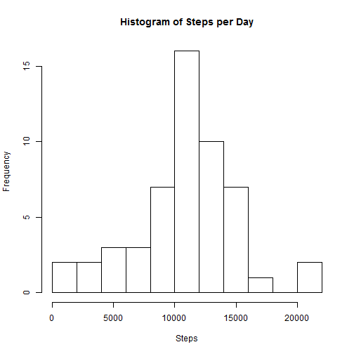
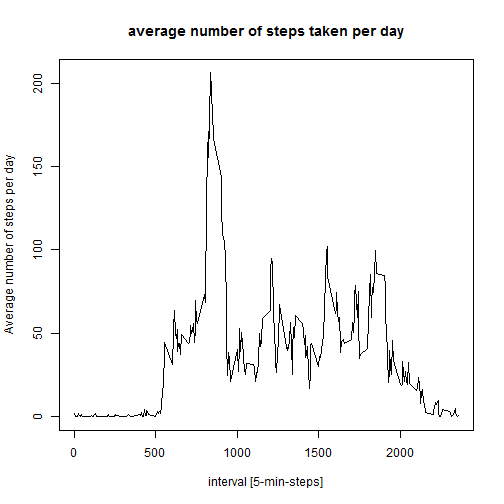
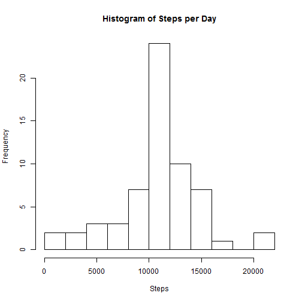
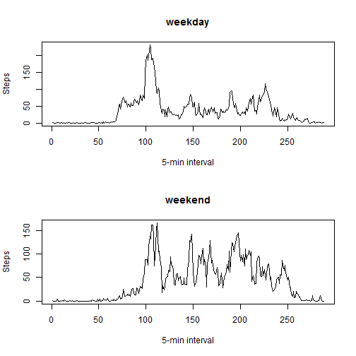

## Loading and preprocessing the data
* Loading the csv file

```r
unzip("repdata_data_activity.zip")
activity <- read.csv("activity.csv")
```

## What is mean total number of steps taken per day?
* Total number of steps taken per day

```r
steps <- aggregate(steps~date,data=activity,sum)
```

* Histogram of the total number of steps taken each day

```r
hist(steps$steps,breaks=10,main="Histogram of Steps per Day",xlab="Steps")
```

 

* Calculate and report the mean and median of the total number of steps taken per day

The mean number of steps taken per day is calculated as follows:

```r
mean(steps$steps)
```

```
## [1] 10766.19
```

The median number of steps taken per day is calculated as follows:

```r
median(steps$steps)
```

```
## [1] 10765
```

## What is the average daily activity pattern?
*  Time series plot of the 5-minute interval and the average number of steps taken, averaged across all days:

```r
intervals <- aggregate(steps~interval,activity,mean)
plot(intervals, type="l",xlab="interval [5-min-steps]",ylab="Average number of steps per day",main="average number of steps taken per day")
```

 

* The 835th 5-minute interval, on average across all the days in the dataset, contains the maximum number of steps

## Imputing missing values
* Total number of missing values in the dataset

```r
sum(is.na(activity$steps))
```

```
## [1] 2304
```

* Creating a new dataset that is equal to the original dataset but with the missing data filled in
For this, we first create a new dataset from the original activity dataset and join the average steps from the intervals dataset:

```r
newactivity <- merge(activity,intervals,by="interval")
```

Now we replace the NA values in the interval column from the original data with the average from that interval:

```r
newactivity$steps.x[is.na(newactivity$steps.x)] <- newactivity$steps.y[is.na(newactivity$steps.x)]
```
* Histogram of the total number of steps taken each day in the new dataset:

```r
steps_new <- aggregate(steps.x~date,data=newactivity,sum)
hist(steps_new$steps.x,breaks=10,main="Histogram of Steps per Day",xlab="Steps")
```

 

* The mean and average numbers of steps per day in the new dataset:

```r
mean(steps_new$steps.x)
```

```
## [1] 10766.19
```

```r
median(steps_new$steps.x)
```

```
## [1] 10766.19
```

## Are there differences in activity patterns between weekdays and weekends?
* Adding a new column to the new dataset to indicate working days or weekends:

```r
newactivity$daytype <- weekdays(as.Date(newactivity$date))

newactivity$daytype[!(newactivity$daytype %in% c("Samstag","Sonntag"))] <- "weekday"
newactivity$daytype[newactivity$daytype %in% c("Samstag","Sonntag")] <- "weekend"
newactivity$daytype <- as.factor(newactivity$daytype)
```

* Plotting a time series plot of the 5-minute interval and the average number of steps taken, averaged across all weekday days or weekend days:
For this we first create two numeric vectors containing the average number of steps for each interval, per "day type":

```r
avgstepsweekday <- tapply(subset(newactivity,daytype=="weekday")$steps.x, subset(newactivity,daytype=="weekday")$interval, mean)
avgstepsweekend <- tapply(subset(newactivity,daytype=="weekend")$steps.x, subset(newactivity,daytype=="weekend")$interval, mean)
```

And plot it:

```r
par(mfrow = c(2, 1))
plot(avgstepsweekday,type="l",xlab="5-min interval",ylab="Steps",main="weekday")
plot(avgstepsweekend,type="l",xlab="5-min interval",ylab="Steps",main="weekend")
```

 
